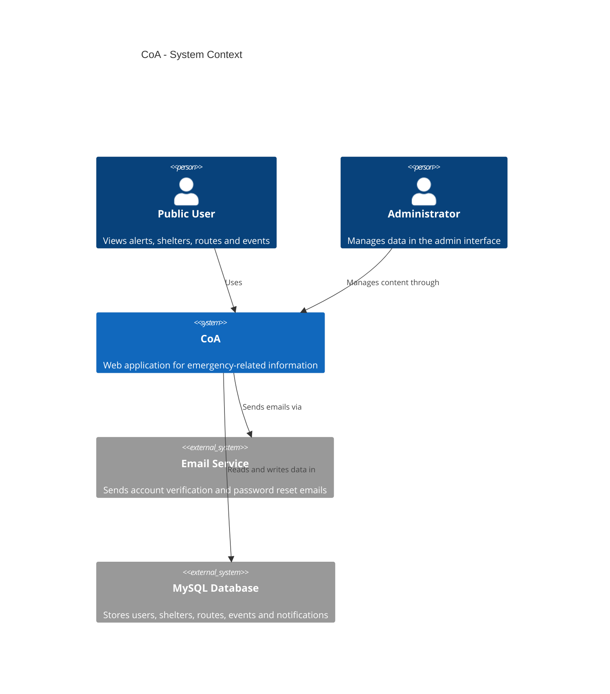
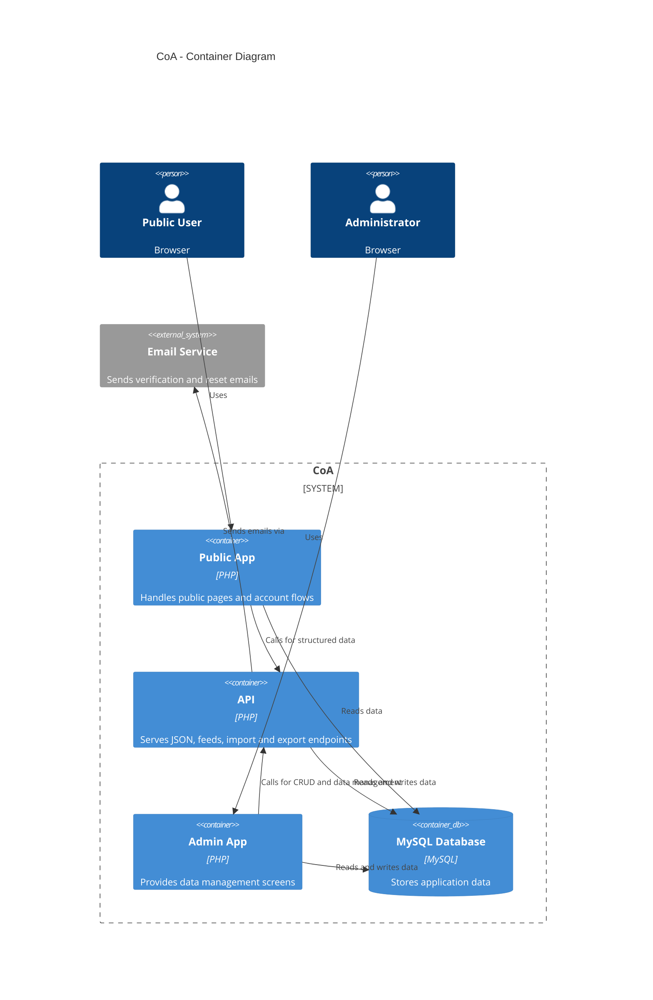

# C4 Diagram

## System Context

## Container View

## Why the API is separate

The API is kept separate from the user-facing app so page rendering stays simple and the data layer can evolve independently. Public pages only handle presentation, while the API handles JSON, feeds, import/export, and other machine-oriented interactions. That separation also makes admin actions and integrations easier to maintain without mixing them into the user experience.
